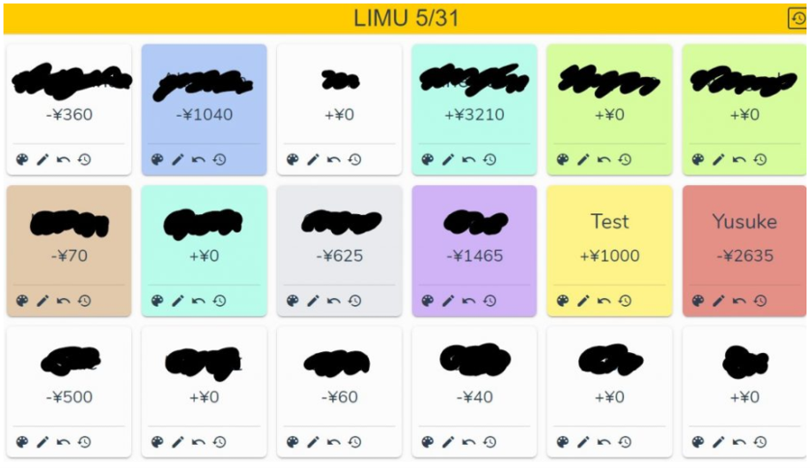
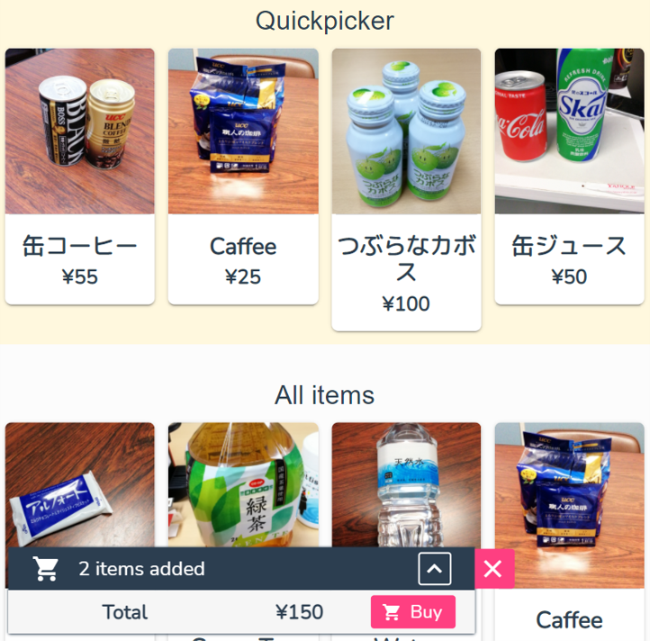

## 概要

私の研究室内の喫茶スペースでは飲食物を後払いで購入することができますが，元々は飲食した料金を紙に記入し，月末に担当者が金額を集計して料金徴収する仕組みとなっていました．

その煩わしさを解消するため，数タップで商品の購入と注文履歴の記録を行えるWebサービスを提案・開発しました．

商品情報やユーザー購入情報を扱うデータベースやユーザー認証等のバックエンド部にFirebaseを利用し，フロントエンドにはVue.jsを利用しました．自動販売機のようなUIを設計し，ユーザーが直感的に使えるような工夫をしました．

まず利用者はユーザ選択画面で自分の名前のカードをタップし，利用したい商品を選択します．

[https://github.com/yamamotsu/TopreSplit](https://github.com/yamamotsu/TopreSplit)