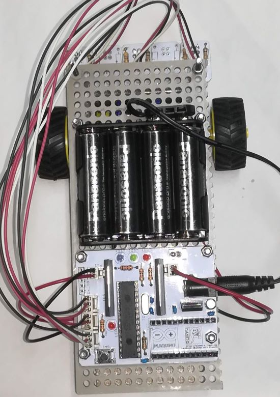
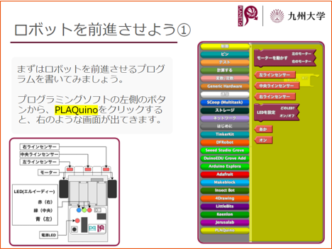

## 概要

宇宙開発サークルで主催した小中学生向けのライントレースロボットの
プログラミング教室にて開発リーダーを担当し，必要な教材の新規開発を行いました．

- Arduinoを用いたライントレースロボットの設計
- ビジュアルプログラミング言語Scrachの上記ロボットへの対応
- 上記ロボットを使ったプログラミングの教材資料作成

を担当しました．
教室で教える内容だけでなく，子供たち自身で工夫できるように，冗長なセンサーやLEDを搭載して自由度を高くしました．

製作したロボット  

教材の内容  

